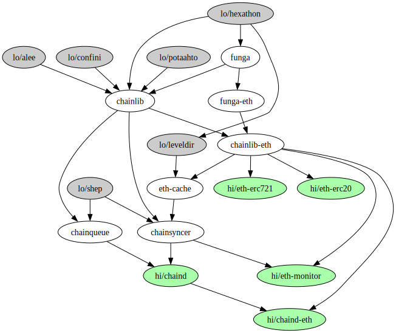

# Chaintool documentation

Chaintool is still very much a work-in-progress, and so too is its documentation.

This README, while still somewhat chaotic, aims to fill the void of a missing structured presentation, and make the introduction to chaintool a bit more friendly.

## Showcasing chaintool

The most intuitive entry point to chaintool is most likely the `eth-monitor` tool. It can be installed directly from `pypi` using `pip install eth-monitor`.

## Code components

Upstream souce of chaintool code is located at [git.defalsify.org](https://git.defalsify.org)

### Core layer

All libraries that are considered part of the `chaintool` suite:

* **funga**, **funga-eth** - message signing tools and daemon for development, with implementation for EVM.
* **chainlib**, **chainlib-eth** - blockchain RPC interface with tooling and implementation for EVM nodes.
* **chainsyncer** - blockchain RPC transaction sync driver.
* **chainqueue** - blockchain RPC transaction queue control.
* **eth-cache** - transparent proxy that stores local copies of RPC results.

### Higher layer

Tools and daemons building on the core layer.

* **eth-monitor** - Visualization and arbitrary code execution for mined transactions
* **chaind**, **chaind-eth** - Full-duplex transaction queueing tool for ethereum

### Lower layer

Libraries that were developed within the context of `chaintool`, but have a more generic scope.

* **shep** - Multi-state key/value stores using bit masks.
* **confini** - Parse and merge multiple ini files.
* **aiee** - Common command line interfacing utils.
* **leveldir** - Multi-level directory structure data stores.
* **hexathon** - Common and uncommon hex string operations.
* **potaahto** - Essentially: Convert between snake and camel case.

The upstream code of these lower layer modules can be found at [holbrook.no/src](https://holbrook.no/src)

## Documentation for chaintool

So far, documentation efforts have been made in four areas, in order of most recently updated first:

### Code components diagram

Last time the author remembered to render it, it looked like this:

The dependency graph is only available in as an unformatted **graphviz** document located at `$REPO_ROOT/deps.dot`. `make diagram` renders this SVG version.

### Man pages

The `chainlib` module provides the script `chainlib-man.py` which provides an inheritance approach to generate man pages for CLI tools that build on the library.

An immediate example can be found in the `chainlib-eth` repository, where the directory `$REPO_ROOT/man` demonstrates how to add hooks for overriding both section contents and argument options for individual tools.

What override behavior is currently available should be straightforward to glean from reading the `$CHAINLIB_REPO_ROOT/scripts/chainlib-man.py` script.

Invoking `make man` in the `chainlib-eth` and `eth-monitor` repositories will trigger a build of man pages for all the CLI tools provided.

### Descriptive documentation

Some initial work for high-level documentation exists in the chainlib repository, specifically in `$REPO_ROOT/doc/texinfo`.

The documentation can be generated by running `make doc` in the `$REPO_ROOT` of **this** repository. The HTML version of the documentation will be output as a single file to `$REPO_ROOT/build/out/index.html`

### Docstrings

Not much to add here. Ye generic sphinx-doc invocation should do the trick.

## High-level implementations

To compensate somewhat for the lack of exhaustive documentation, actual implementations using the library may help light the way somewhat.

Aside from the "higher level" components listed above, two known EVM-based implementations that have some minimum level of maturity are:

* [eth-erc20](https://git.defalsify.org/eth-erc20) - an implementation of the ERC20 token, which also includes an example token contract that lets authorized addresses arbitrarily mint tokens at any time.
* [eth-erc721](https://git.defalsify.org/eth-erc721) - an implementation of the ERC721 "NFT" token, which also includes an example token contract that creates achievment badges for developed contributions.
